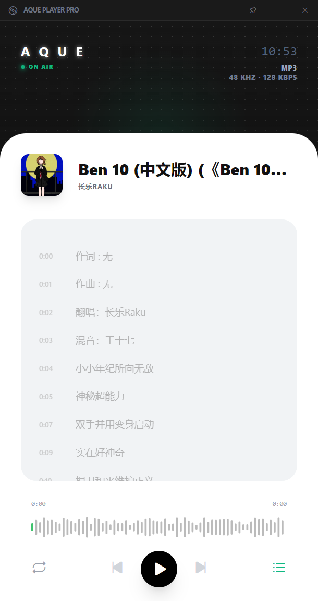

<div align="center">
  
  <h1>🎵 AQUE Player</h1>
  <p>
    <strong>Windows 本地音乐播放器</strong><br/>
    基于 Electron + BASS 音频引擎
  </p>
</div>

<p align="center">
  
  
  
</p>

---

## ✨ 特性

- 🎧 **高音质播放** — 基于 BASS 音频引擎，支持 16 种音频格式
- 📋 **播放列表管理** — 多专辑/文件夹管理，拖拽排序，搜索过滤
- 📜 **歌词支持** — 嵌入歌词 ID3 标签、外挂 LRC、在线歌词搜索（网易云/QQ音乐/酷狗）
- 📊 **频谱可视化** — 实时 FFT 频谱动画 + 波形进度条
- 🖼️ **专辑封面** — 懒加载封面图，LRU 缓存优化
- 🎮 **系统媒体控制** — SMTC 集成（任务栏进度条、媒体按键）
- 🔄 **多种播放模式** — 列表循环、单曲循环、随机播放
- 📌 **窗口置顶** — 迷你模式，始终置顶
- 🖥️ **托盘控制** — 系统托盘快捷操作

## 🎵 支持的格式

| 类别 | 格式 |
|------|------|
| 通用 | MP3, WAV, OGG, AAC, M4A |
| 无损 | FLAC, APE, WV, AIFF, DSD (DSF/DFF) |
| 流媒体 | WMA, OPUS, MPC |
| 其他 | MID, MIDI |

## 🚀 快速开始

### 环境要求

- **Windows** 7 或更高版本（x64）
- **Node.js** 16+

### 安装与运行

```bash
# 克隆仓库
git clone https://github.com/an-qiong1/Aque-Music.git
cd Aque-Music

# 安装依赖
npm install

# 启动应用
npm run dev
```

### 构建安装包

```bash
# 构建 NSIS 安装包
npm run build

# 构建便携版（免安装）
npm run build:portable
```

## 🛠️ 技术栈

| 层 | 技术 |
|----|------|
| 框架 | Electron 24 |
| 音频引擎 | BASS (bass.dll) |
| 歌词解析 | music-metadata, iconv-lite |
| 文件监听 | chokidar |
| 图标 | Phosphor Icons |
| 样式 | Tailwind CSS |
| 后台音乐识别 | 网易云/QQ音乐/酷狗 API |

## 📁 项目结构

```
src/
├── main/              # Electron 主进程
│   ├── audio/         # BASS 音频引擎封装
│   ├── ipc/           # IPC 处理器 (文件/标签/播放列表/统计等)
│   ├── library/       # 音乐库索引与扫描
│   ├── lyrics/        # 在线歌词搜索提供器
│   ├── smtc/          # 系统媒体传输控制
│   └── utils/         # 工具模块 (托盘/快捷键/播放统计/睡眠定时器等)
├── preload/           # 安全的 contextBridge API
└── renderer/          # 渲染进程 UI
    ├── css/           # 样式文件
    └── js/            # 前端逻辑模块
```

## 📄 许可证

MIT License
